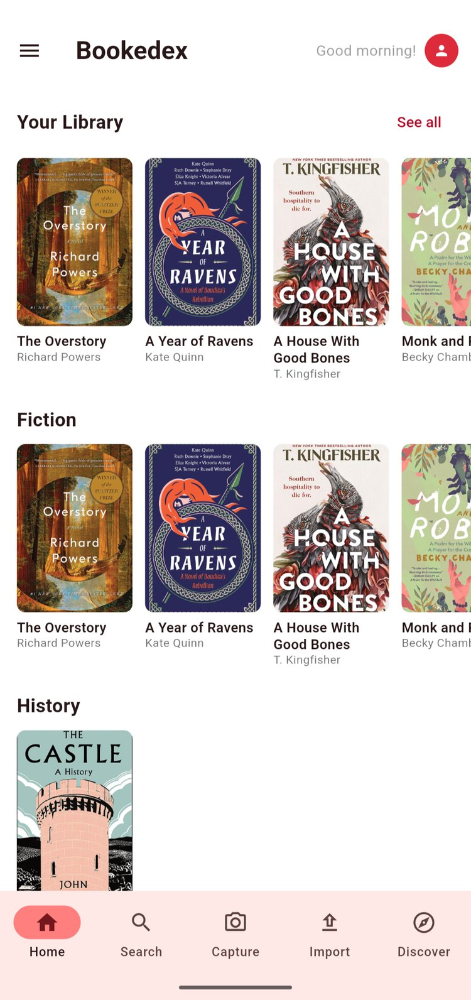

<p align="center">
  
</p>

<h1 align="center">Bookedex</h1>

<p align="center">
  Photograph a book cover, or screenshot one from TikTok or Instagram, and it lands in one visual library.<br>
  When you can't decide what to read next, a short quiz will pick one book you already own <i>(in development)</i>.
</p>

<p align="center">
  Flutter · Dart · Firebase · Google ML Kit · Riverpod · iOS + Android
</p>

<p align="center">
  
  &nbsp;&nbsp;
  
</p>

---

## Why it exists

Readers save books everywhere: camera rolls full of bookstore photos, screenshots of BookTok recommendations, wishlists in three different apps. The saved list grows until it's too long to choose from, so the saving never turns into reading. Bookedex gathers those captures into one library, and is being built to help with the part saving never does, which is choosing a book to read.

It's deliberately **not** a social network or a Goodreads clone. It has no feeds, no friends and no push notifications. Those choices came from interviews with our target user, who turns off notifications in almost every app.

## Status

**In beta.** Version 1.0.0 is submitted for TestFlight beta review on iOS. Android builds and runs on device, and a Google Play release is next.

| Built | Next |
|---|---|
| Camera capture, batch photo and screenshot import | Book detail view |
| On-device text recognition → book lookup | Shelves and personal tags |
| Confidence-based auto-add, with a swipe review queue for uncertain matches | Mood quiz → one recommendation |
| Visual library: home rows, cover grid, genre filters | In-app reminders about unread books |
| iOS release pipeline (signing, TestFlight) | User accounts |

## How recognition works

```
photo or screenshot
  → ML Kit OCR (on-device; the photo never leaves the phone)
  → query builder    picks the lines likely to be title and author
  → Google Books search (falls back to Open Library on timeout, 429 or 5xx)
  → fuzzy rerank + confidence score
  → ≥ 75% confident: added automatically
    < 75%: swipe review card showing the photo and the best guess side by side
```

The hard part is the **query builder**. Real covers carry taglines, review quotes, "NATIONAL BESTSELLER" banners and publisher logos. Bookstore photos include the spines of neighbouring books. Screenshots wrap everything in social-media UI. The builder filters that noise, scores the remaining lines and joins the best ones **in reading order**, because a title split over several lines only reads as a title in the order it was printed.

## Engineering highlights

**Recognition accuracy went from 7/20 to 16/20 on real user photos.** The test set is our target user's own book collection, not curated stock images. Gains came from reworking line selection, filtering spine text (a bounding box taller than it is wide is a neighbouring book's spine), and switching data sources after measuring both on the same photos.

**A testable recognition pipeline, with no device needed.** OCR output from the physical phone (text plus bounding boxes) is captured into test fixtures, so a query-builder change is checked in seconds instead of re-importing 20 photos. Confidence scoring is tested offline too: 19 of 20 on-device confidence scores matched the offline prediction exactly. **52 unit tests.**

**A platform bug found by comparing devices.** On iOS, ML Kit reports text bounding boxes in the photo's unrotated orientation, so a photo with rotation metadata arrives with every box sideways. The spine filter then threw away the real cover text. The fix normalises the geometry at the point where ML Kit's data enters the app, and it applies only on iOS, after the first version broke a good Android photo. Books matched on iOS went from 12/19 to 19/19.

**Crashes diagnosed from crash reports, not guesses.** A large import crashed on iOS. The obvious theory was memory pressure. The crash report said otherwise: the exception type pointed to a freed object being reused inside ML Kit's analytics logger, triggered by creating a new text recognizer for every photo. One shared recognizer fixed the crash and made imports faster, because each new recognizer was reloading the OCR model.

**Calibrated auto-add.** The 75% threshold isn't a guess. It is the lowest value that keeps every known wrong match out of the library, re-measured each time the data source or scoring changed. Uncertain matches go to a Tinder-style review card: swipe right to accept, left to skip, up to search manually.

**Considered security.** The API key is injected at build time and never committed. Because any key shipped in an app can be extracted, the real control is server-side: the key is restricted to the Books API, which has no billing attached. User data is protected by Firestore security rules.

## Tech stack

| Layer | Choice |
|---|---|
| App | Flutter / Dart, Riverpod for state |
| Recognition | Google ML Kit text recognition (on-device) |
| Book data | Google Books API, with Open Library as a fallback |
| Backend | Firebase: Firestore, anonymous Auth |
| Platforms | iOS (TestFlight beta) and Android |

## Project layout

```
bookshelf_app/lib/
├── services/   OCR, query builder + book lookup, Firestore repository
├── providers/  Riverpod state: import routing, review queue, library stream
├── screens/    home, library grid, capture, import, swipe review, manual search
├── models/     Book, pending review items
└── widgets/    shared UI
bookshelf_app/test/
└── fixtures/   real OCR output and Google Books candidates captured from device
```

## Running it

Requires Flutter and a Google Books API key.

```bash
cd bookshelf_app
echo "GOOGLE_BOOKS_API_KEY=your_key_here" > .env
flutter pub get
flutter run --dart-define-from-file=.env
flutter test
```

Recognition needs a physical device. ML Kit ships no simulator build for Apple silicon, and the Android emulator reads text more accurately than real phones, which makes accuracy results look better than they are.

## Team

- **Bode Kaanta**: sole developer
- **Richie**: product, UX/UI design, marketing
- **Margot**: target user and a beta tester

Part of why I started this project was to learn to build software with AI. I used Claude Code as a pair programmer throughout; I directed the design, reviewed and understood every change, and tested on device before each commit. [`CLAUDE.md`](CLAUDE.md) is the project's working notes: the decisions I made, the test results behind them, and the approaches that didn't work.

---

© Bode Kaanta. All rights reserved. The source is public to read. It is not licensed for reuse.
